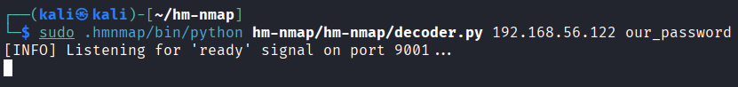
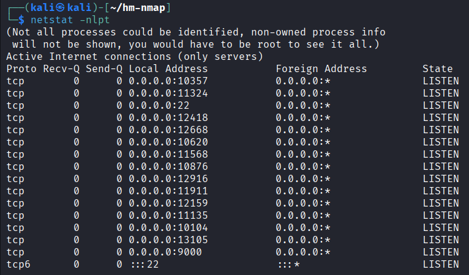
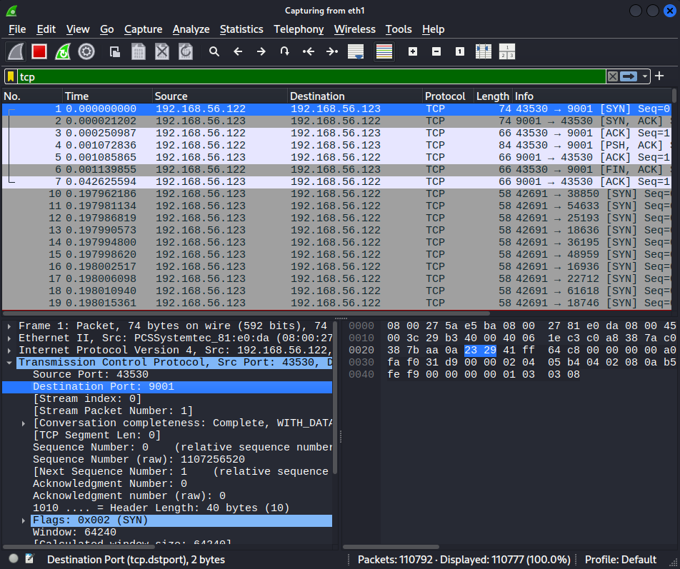
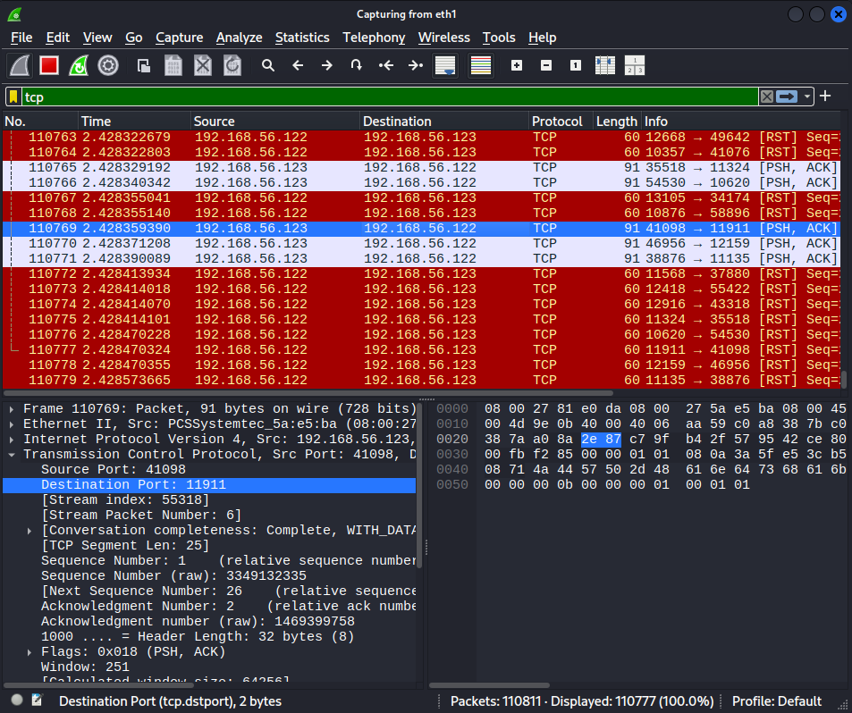
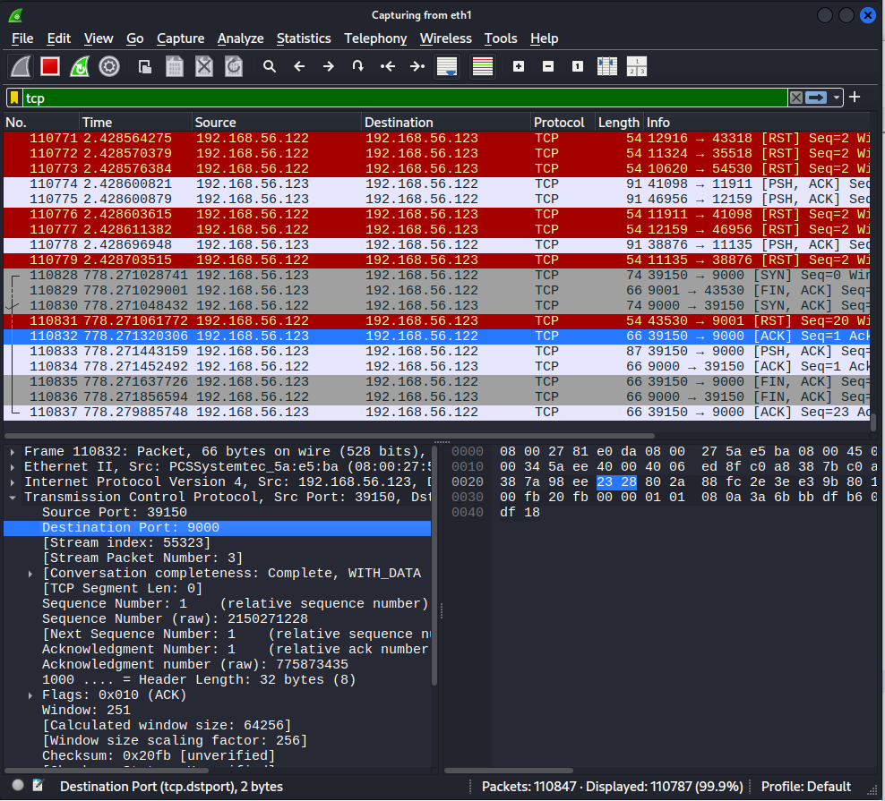
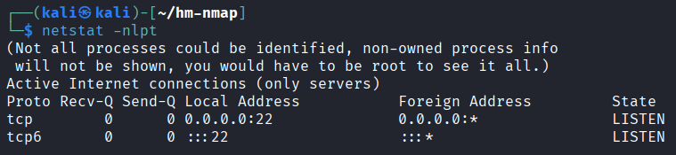

# 🕵️‍♂️ HM-Nmap: Covert Communication via Port Manipulation 🕵️‍♂️


[](https://github.com/pdudotdev/hm-nmap/releases/tag/v0.1.0)

**HM-Nmap** is a Python-based tool for Linux that enables stealthy communication between two parties by encoding messages into open TCP ports. The **encoder** script converts a plaintext message into a series of open ports, while the **decoder** scans these ports using **nmap** to reconstruct the original message. This technique leverages port scanning capabilities and is particularly useful in scenarios where traditional communication channels are monitored or restricted.

🍀 **NOTE:** This is an ongoing **research project** for educational purposes rather than a full-fledged production-ready tool, so treat it accordingly.

## 📋 Table of Contents

- [🕵️ HM-Nmap: Stealthy Communication via Port Manipulation](#%EF%B8%8F%EF%B8%8F-hm-nmap-stealthy-communication-via-port-manipulation)
  - [🎯 Advantages](#-advantages)
  - [⚙️ Installation](#%EF%B8%8F-installation)
  - [🛠️ How It Works](#%EF%B8%8F-how-it-works)
  - [⛑️ Security Considerations](#%EF%B8%8F-security-considerations)
  - [🚀 Planned Upgrades](#-planned-upgrades)
  - [⚠️ Disclaimer](#%EF%B8%8F-disclaimer)
  - [📜 License](#-license)
  - [🙏 Special Thank You](#-special-thank-you)

## 🎯 Advantages

- **Easy to Use**: Host 1 (the **Encoder**) encodes a covert message by opening certain ports.
- **Stealthy**: Host 2 (the **Decoder**) utilizes **nmap** port scanning to decode the hidden message.
- **No Additional Dependencies**: Relies on standard Python libraries and `nmap`, which is freely available.
- **Secure**: Needs a pre-shared password (token), thus only allowing communication with the intended host. 
- **Messaging**: Supports messages up to 100 characters. Limit may increase in future versions.

## ⚙️ Installation

### Prerequisites

- Python 3.8 or higher
- `python-nmap` and `nmap` installed on the decoder machine

### Steps

1. **Prepare the Environment (both hosts)**
```bash
mkdir hm-nmap
cd hm-nmap
python3 -m venv .hmnmap
source .hmnmap/bin/activate
git clone https://github.com/pdudotdev/hm-nmap.git
```

2. **Install Python-Nmap (Decoder host only)**
```bash
pip install python-nmap
```

3. **Install Nmap (Decoder host only)**
```bash
sudo apt install nmap
```

## 🛠️ How It Works

- **Important**: Make sure the **Decoder** is running and listening *before* executing the **Encoder** script on the other host.
- **Testing**: **HM-Nmap** has been (and is) currently tested only with **Kali Linux**. Other distros such as **Ubuntu** should be fine, too.

Let's walk through an example of how **HM-Nmap** encodes and decodes the secret message `"hello, world!"`.
- **Encoder IP**: `192.168.56.122`
- **Decoder IP**: `192.168.56.123`
- **Shared Token**: `our_password`

1. 🎯 **Run the Decoder Script**

```
cd ~/hm-nmap
sudo .hmnmap/bin/python hm-nmap/hm-nmap/decoder.py 192.168.56.122 our_password
```

- **`<encoder_ip>`**: IP address of the encoder machine.
- **`<shared_token>`**: Pre-shared secret token for authentication.



2. 🎯 **Run the Encoder Script**

   ```
   python3 encoder.py <decoder_ip> <shared_token>
   ```

   - **`<decoder_ip>`**: IP address of the decoder machine.
   - **`<shared_token>`**: Pre-shared secret token for authentication.

3. 🎯 **Input the Message**
```
[INPUT] Enter the message to encode (max 100 characters): hello, world!
```

4. 🎯 **Port Calculation**

Each character in the message is converted to its ASCII value and mapped to a unique port number using the formula:
```
port = base_port + (position_in_message * 256) + ASCII_value
```
   - **`base_port`**: 10000
   - **`position_in_message`**: Zero-based index of the character in the message.
   - **`ASCII_value`**: ASCII code of the character.

| Position | Character | ASCII Value | Port Calculation                         | Port Number |
|----------|-----------|-------------|------------------------------------------|-------------|
| 0        | h         | 104         | 10000 + (0 * 256) + 104 = 10104          | 10104       |
| 1        | e         | 101         | 10000 + (1 * 256) + 101 = 10357          | 10357       |
| 2        | l         | 108         | 10000 + (2 * 256) + 108 = 10620          | 10620       |
| 3        | l         | 108         | 10000 + (3 * 256) + 108 = 10876          | 10876       |
| 4        | o         | 111         | 10000 + (4 * 256) + 111 = 11135          | 11135       |
| 5        | ,         | 44          | 10000 + (5 * 256) + 44 = 11324           | 11324       |
| 6        |           | 32          | 10000 + (6 * 256) + 32 = 11568           | 11568       |
| 7        | w         | 119         | 10000 + (7 * 256) + 119 = 11911          | 11911       |
| 8        | o         | 111         | 10000 + (8 * 256) + 111 = 12159          | 12159       |
| 9        | r         | 114         | 10000 + (9 * 256) + 114 = 12418          | 12418       |
| 10       | l         | 108         | 10000 + (10 * 256) + 108 = 12668         | 12668       |
| 11       | d         | 100         | 10000 + (11 * 256) + 100 = 12916         | 12916       |
| 12       | !         | 33          | 10000 + (12 * 256) + 33 = 13105          | 13105       |

5. 🎯 **Checking Open Ports**

All the necessary ports have been opened on the Encoder machine.



6. 🎯 **Encoder Ready**

The encoder sends a "ready" signal to the decoder's TCP port 9001, whilst also listening on its own port 9000 for a message receipt from the decoder.

```
[INFO] Attempting to open ports.
[INFO] Control server is listening on port 9000
[INFO] Ready signal sent to the decoder.
```

7. 🎯 **`Message Is Ready` Signal**

The decoder listens for the ready signal from the encoder and gets it - port 9001.

```
[INFO] Listening for 'ready' signal on port 9001...
[INFO] Received valid 'ready' signal from the encoder.
[INFO] Scanning <encoder_ip> for open ports in range 10000-65535...
```



8. 🎯 **Scanning Encoder's Ports via NMAP**

The decoder immediately starts scanning the encoder's open ports in the specified range.

```
[INFO] Scanning 192.168.56.122 for open ports in range 10000-65295...
```



9. 🎯 **Decoding the Ports**

Each open port is mapped back to its corresponding character using the formula:
```
character = chr((port - base_port) % 256)
```

| Port Number | Calculation                     | Character |
|-------------|---------------------------------|-----------|
| 10104       | (10104 - 10000) % 256 = 104     | h         |
| 10357       | (10357 - 10000) % 256 = 101     | e         |
| 10620       | (10620 - 10000) % 256 = 108     | l         |
| 10876       | (10876 - 10000) % 256 = 108     | l         |
| 11135       | (11135 - 10000) % 256 = 111     | o         |
| 11324       | (11324 - 10000) % 256 = 44      | ,         |
| 11568       | (11568 - 10000) % 256 = 32      |           |
| 11911       | (11911 - 10000) % 256 = 119     | w         |
| 12159       | (12159 - 10000) % 256 = 111     | o         |
| 12418       | (12418 - 10000) % 256 = 114     | r         |
| 12668       | (12668 - 10000) % 256 = 108     | l         |
| 12916       | (12916 - 10000) % 256 = 100     | d         |
| 13105       | (13105 - 10000) % 256 = 33      | !         |

The message is then displayed to the user:
```
[MESSAGE DECODED] Encoder says: hello, world!
```

10. 🎯 **Message Confirmation**

Decoder then asks the user to confirm message receipt to the encoder.
```
[INPUT] Do you want to confirm receipt to the encoder? y is recommended (y/n):
```

11. 🎯 **Shutdown Signal**

After the user enters `y` at the prompt, the TCP shutdown signal is sent to the encoder's port 9000.
```
[INPUT] Do you want to confirm receipt to the encoder? y is recommended (y/n): y
[INFO] Shutdown signal sent to the encoder.
```



12. 🎯 **Encoder Side After Shutdown**

Upon receiving the shutdown signal, the encoder cleans up by closing all opened ports.

```
The message was read by the other party.
Cleaning up ports by shutting them down.
All ports have been closed.
```



## ⛑️ Security Considerations
- **Administrative Privileges**: **HM-Nmap** requires **sudo** privileges, so ensure that only trusted users have access to the scripts.
- **Network Impact**: Manipulating open ports can have unintended consequences on network operations. Use **HM-Nmap** in controlled environments.
- **Pre-shared Token**: Be cautious with token sharing. Always share the secret password through a separate secure channel.
- **Closing Ports**: Closing ports may violate organizational policies. Ensure compliance before using **HM-Nmap**.

## 🚀 Planned Upgrades
- [x] Improved CLI experience
- [ ] Increased message length
- [ ] More testing is needed

## ⚠️ Disclaimer
**HM-Nmap** is intended for educational and authorized security testing purposes only. Unauthorized interception or manipulation of network traffic is illegal and unethical. Users are responsible for ensuring that their use of this tool complies with all applicable laws and regulations. The developers of **HM-Nmap** do not endorse or support any malicious or unauthorized activities. Use this tool responsibly and at your own risk.

## 📜 License
**HM-Nmap** is licensed under the [GNU GENERAL PUBLIC LICENSE Version 3](https://github.com/pdudotdev/hm-nmap/blob/main/LICENSE).

## 🙏 Special Thank You
The idea behind creating **HM-Nmap** was inspired by the concept of **Network Dead Drops** pioneered by Tobias Schmidbauer, Steffen Wendzel, Aleksandra Mileva and Wojciech Mazurczyk in **Introducing Dead Drops to Network Steganography using ARP-Caches and SNMP-Walks** (more details [here](https://dl.acm.org/doi/10.1145/3339252.3341488)).

Main differences between the original approach and **HM-Nmap**:
- **HM-Nmap** introduces a new flavor of **Network Dead Drops**, named **Passive Self-Hosted Network Dead Drops**.
- **Passive** because no active connection is established. **Self-Hosted** because the encoder stores the hidden message.
- Unlike the original **Network Dead Drops** concept, **HM-Nmap** does not use an unaware 3rd party to store hidden messages.
- Unlike the original **Network Dead Drops** concept, **HM-Nmap** uses a completely different method for storing the message.
- Unlike the original **Network Dead Drops** concept, **HM-Nmap** the receiver (decoder) scans the encoder to get the message.
- **HM-Nmap** does not involve a 3rd party for the dead drop which may raise suspicions or be illegal. Also reduces complexity.
- Other differences in nuances of the overall logic and communication flow, as well as of the actual code implementation.
