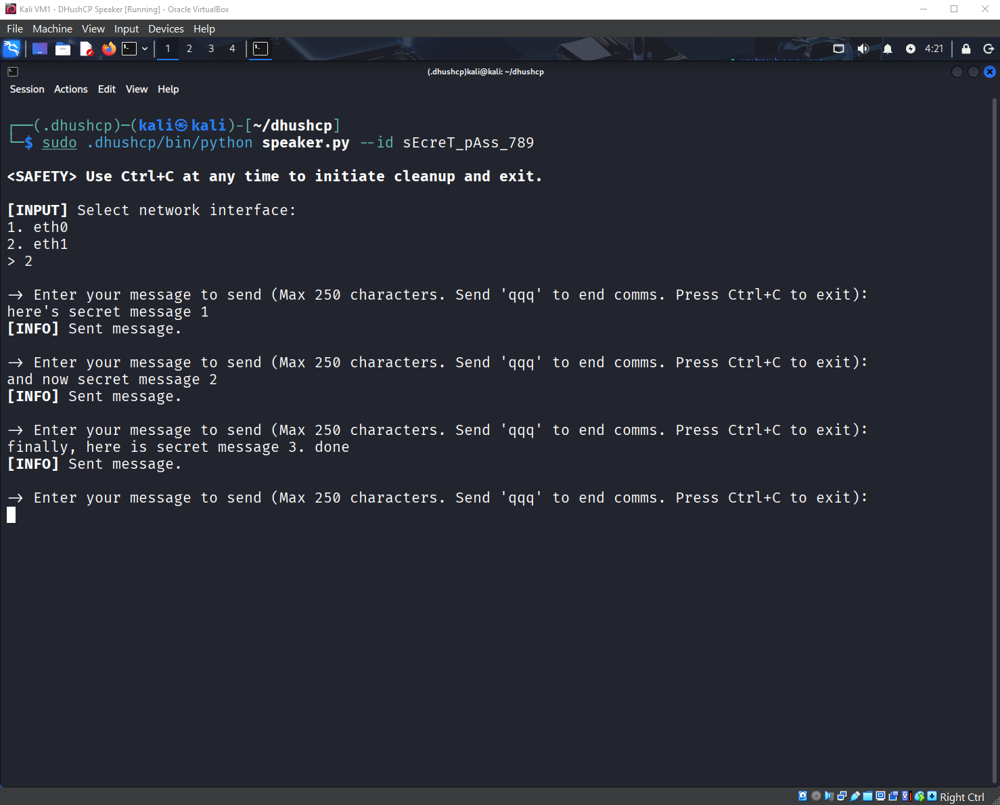
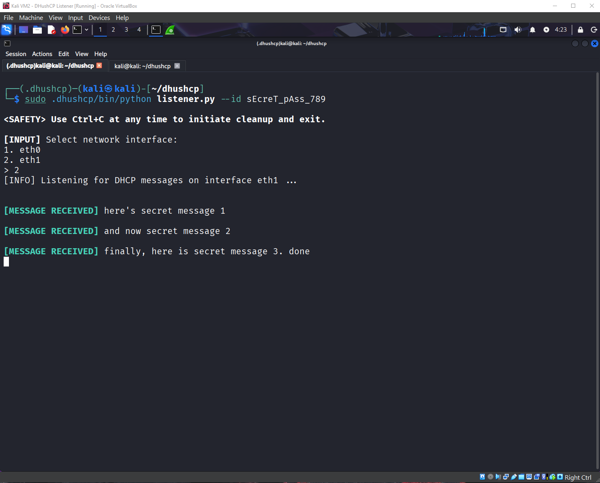
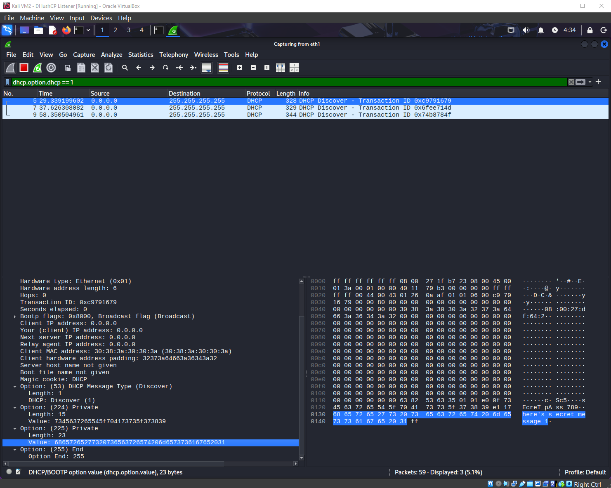
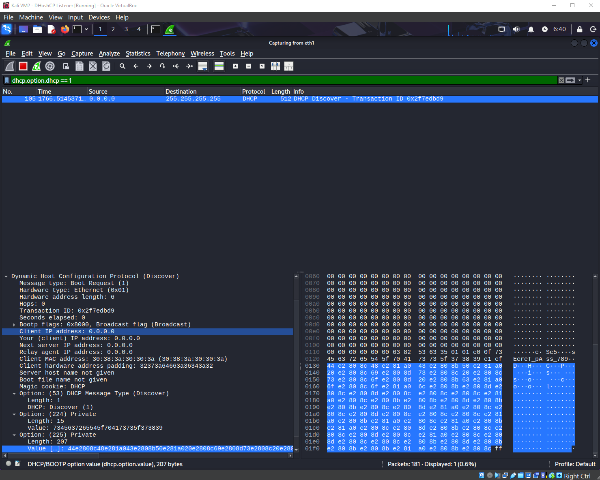

# 🛡️ DHushCP: Covert Communication via DHCP 🛡️


[](https://github.com/pdudotdev/DHushCP/releases/tag/v0.2.0)
[](https://github.com/pdudotdev/DHushCP/commits/main/)

## 📖 Table of Contents

- [🛡️ DHushCP: Covert Communication via DHCP](#%EF%B8%8F-dhushcp-covert-communication-via-dhcp-%EF%B8%8F)
  - [🔍 Overview](#-overview)
  - [🚀 Features](#-features)
  - [🖥️ System Requirements](#%EF%B8%8F-system-requirements)
  - [🛠️ Installation and Setup](#%EF%B8%8F-installation-and-setup)
  - [🔄 Communication Flow](#-communication-flow)
  - [🔎 Extra Mile: Using Nested Text Steganography](#-extra-mile-using-nested-text-steganography)
  - [🎯 Planned Upgrades](#-planned-upgrades)
  - [⚠️ Disclaimer](#%EF%B8%8F-disclaimer)
  - [📜 License](#-license)

## 🔍 Overview

**DHushCP** is a Linux tool designed to facilitate **secure covert message transmission** between two parties - a Speaker and a Listener - using standard **DHCP (Dynamic Host Configuration Protocol)** packets. 

**DHushCP** utilizes principles of **network steganography** by embedding messages within DHCP protocol fields that are not commonly inspected, such as Options 224 and 225.

By using plain **DHCP Discover** packets, the communication blends into normal traffic. It is advisable to keep a **low number** of message transmissions per session, so that the amount of Discover packets being sent by the Speaker doesn't raise any eyebrows. See the **Use Case** below for an example.

🍀 **NOTE:** This is an ongoing **research project** for educational purposes rather than a full-fledged production-ready tool, so treat it accordingly.

## 🚀 Features

- **Message Embedding:** Efficiently embeds messages to fit within DHCP option constraints, ensuring seamless transmission.
- **Automated Cleanup:** Automatically handles session termination and clears the terminal screen upon completion.
- **User-Friendly Interface:** Interactive prompts guide the user through message input and confirmation steps.

## 🖥️ System Requirements

- **Operating System:** Linux-based systems (e.g., Kali, Ubuntu, Debian)
  - Latest release thoroughly tested and functional on **Ubuntu 24.04**.
- **Python Version:** Python 3.8 or higher
- **Dependencies:**
  - `scapy` for packet crafting and sniffing
- **Privileges:** Sudo access to send and receive DHCP packets
- **Network Interface:** Active network interface in UP state

## 🛠️ Installation & Setup

1. **Clone the Repository:** Use the commands below in your Linux terminal.
   ```bash
   mkdir dhushcp
   cd dhushcp
   python3 -m venv .dhushcp
   source .dhushcp/bin/activate
   git clone https://github.com/pdudotdev/DHushCP.git
   ```

2. **Install Dependencies:** Ensure you have Python 3.8 or higher installed. Then, install the required Python packages.
   ```bash
   pip install scapy colorama
   ```

3. **Configure Network Interface:** Ensure that your network interface is active and in the UP state. **DHushCP** will automatically detect and prompt you to select the proper interface if multiple are detected.

4. **Run the Scripts:** Both the Speaker and Listener scripts require root privileges to send and sniff DHCP packets. You can run the scripts using `sudo`:

**Speaker:**
```
   cd ~/dhushcp
   sudo .dhushcp/bin/python DHushCP/dhushcp/speaker.py --id DHUSHCP_ID
```

**Listener:**
```
   cd ~/dhushcp
   sudo .dhushcp/bin/python DHushCP/dhushcp/listener.py --id DHUSHCP_ID
```

Follow the on-screen prompts on the **Speaker** to initiate and manage the communication session. Make sure the **Listener** is already listening when running the **Speaker**.

## 🔄 Communication Flow & Example Use Case

#### **Problem**
Alice needs to send Bob one or more crucial messages without using any messaging app, or creating any obvious network link or visible ad-hoc connection that could attract attention and be easily detected by anyone monitoring the network. Remember that this is a one-way communication channel from Alice to Bob, and when Alice finishes the message they both exit the application gracefully.

🔴 **Prerequisites:**
- Prior to their arrival, Alice and Bob **should already know** the DHUSHCP_ID they're going to use *and* who's going to run the **Speaker** and the **Listener**, respectively.
- They ensure that the DHUSHCP_ID is communicated **securely** between them before initiating the communication. Use a strong, unpredictable identifier.

#### **Solution: Using DHushCP for Covert Communication**
**Message Transmission:**
   - **Speaker:**
     - Detects all network interfaces and prompts the user to select one.
     - Prompts the user to input a message to send to the Listener.
     - **Usable Space In DHCP Option:** 255 bytes. Max. message length is set to 250 ASCII characters.
     - Embeds the message into DHCP option 225.
     - Embeds the pre-shared DHUSHCP_ID into DHCP option 224.
     - Sends the DHCP Discover packet containing the secret message.
     - After each sent message, the Speaker can send a new message right away.



   - **Listener:**
     - Needs to run before the Speaker starts sending messages.
     - Detects all network interfaces and prompts the user to select one.
     - Listens for DHCP Discover packets with option 224 set to DHUSHCP_ID.
     - Extracts the Speaker's hidden message from DHCP option 225.



**Traffic Capture:**
   - **DHCP Packets:**
     - There are three DHCP Discover packets being sent from the **Speaker** to the **Listener**, one for each message.
     - The pre-shared **DHUSHCP_ID** is embedded in option 224, whilst the message resides inside option 225.



**Ending Communication:**
   - **Speaker:**
     - After sending all messages, the user sends a final message: `qqq`
     - Upon sending the `qqq` signal, the Speaker exits the application and clears the terminal.

   - **Listener:**  
     - Upon receiving the `qqq` signal, the Listener understands that the message flow is complete, exits the application and clears the terminal.


## 🔎 **Extra Mile: Using Nested Text Steganography**

This project also uses **zero-width Unicode characters** to hide a secret message *inside* an otherwise normal-looking text (the **cover text**). Zero-width characters are invisible when displayed, but they still exist in the byte stream and can carry data.

#### Core Idea

- **Plaintext message** is converted to binary
- **Binary data** is encoded into zero-width characters
- **Zero-width characters** are injected between visible characters of a cover text
- On the receiving side, zero-width characters are extracted and decoded back into the original plaintext

#### Bit-to-Character Mapping

Each zero-width character encodes **2 bits**:

- `U+200B` - 00 - Zero Width Space
- `U+200C` - 01 - Zero Width Non-Joiner
- `U+200D` - 10 - Zero Width Joiner
- `U+2060` - 11 - Word Joiner

#### Capacity Rules

- **1 plaintext character** = **8 bits**
- **1 zero-width character** = **2 bits**
- So **4 zero-width characters** are required to hide **1 plaintext character**

Now:
- Each zero-width character occupies **3 bytes** in UTF-8
- So for **1 plaintext character**:
  - `4 × 3 bytes = 12 bytes` of hidden data

Because DHCP options are limited to **255 bytes**, this directly limits how much plaintext you can hide.

#### Executing the Code
Run both **_ts** scripts with the `--text-stego` or `-ts` flag to enable the nested text stego feature.

**Speaker:**
```
   cd ~/dhushcp
   sudo .dhushcp/bin/python DHushCP/dhushcp/speaker_ts.py --id DHUSHCP_ID --text-stego
```

**Listener:**
```
   cd ~/dhushcp
   sudo .dhushcp/bin/python DHushCP/dhushcp/listener_ts.py --id DHUSHCP_ID --text-stego
```

#### Example: Cover Text
`DHCP is so cool`
(15 visible characters)

#### Plaintext Message
`secret message 1`
(16 plaintext characters)

#### Message Size on Wire (option 225)

`option225_size = 15 + (16 * 12) = 207 bytes`

#### Encoding Process (Speaker)

1. `"s"` → `01110011`
2. Split into 2-bit chunks → `01 11 00 11`
3. Map to zero-width chars → `\u200C \u2060 \u200B \u2060`
4. Inject invisibly after visible characters

#### What Gets Transmitted

Visibly:
`DHCP is so cool`

On the wire (also see the screenshot below):
`D[ZW]H[ZW]C[ZW]P[ZW] i[ZW]s[ZW] ...`



#### Decoding

On the **Listener** side:

1. Extract all zero-width characters
2. Convert them back to 2-bit values
3. Reassemble bytes (8 bits)
4. Recover the original plaintext message

## 🎯 Planned Upgrades
- [x] Improved CLI experience
- [ ] Message fragmentation
- [ ] More testing is needed

## ⚠️ Disclaimer
**DHushCP** is intended for educational and authorized security testing purposes only. Unauthorized interception or manipulation of network traffic is illegal and unethical. Users are responsible for ensuring that their use of this tool complies with all applicable laws and regulations. The developers of **DHushCP** do not endorse or support any malicious or unauthorized activities. Use this tool responsibly and at your own risk.

## 📜 License
**DHushCP** is licensed under the [GNU GENERAL PUBLIC LICENSE Version 3](https://github.com/pdudotdev/DHushCP/blob/main/LICENSE).