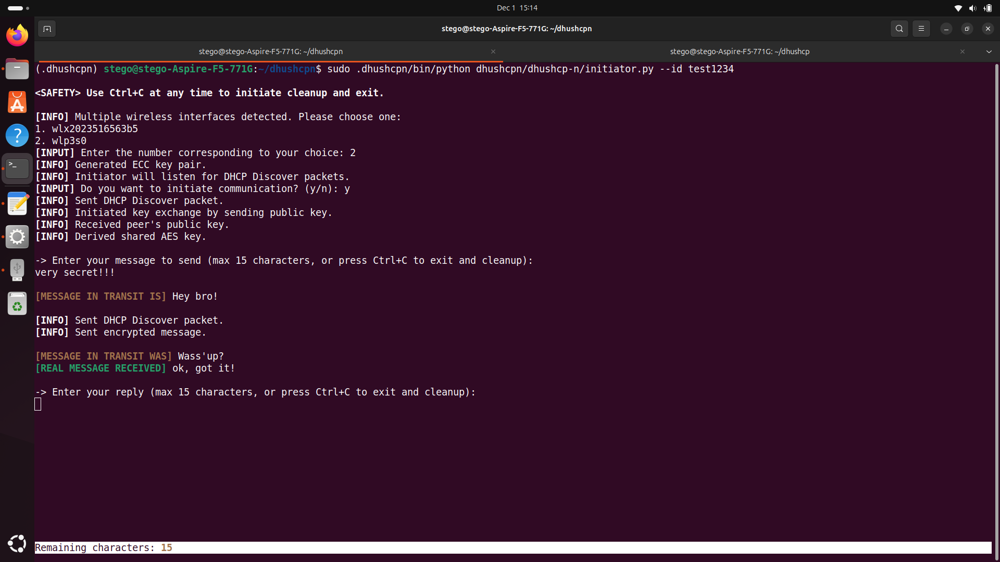
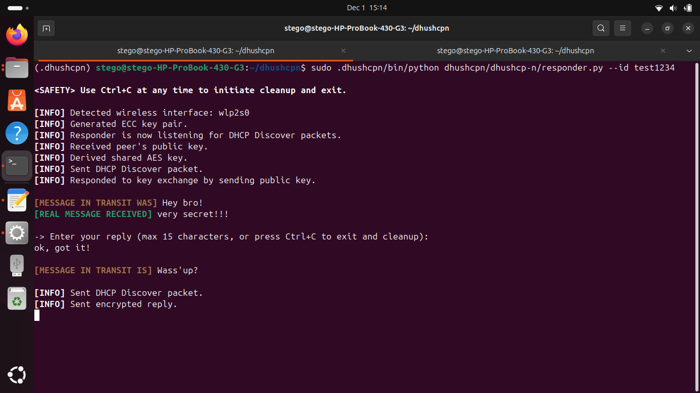
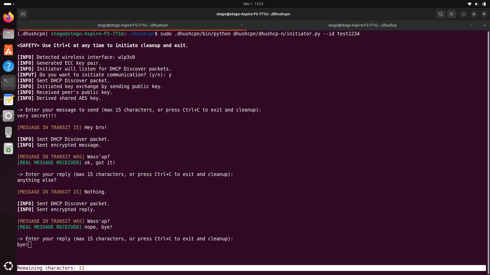
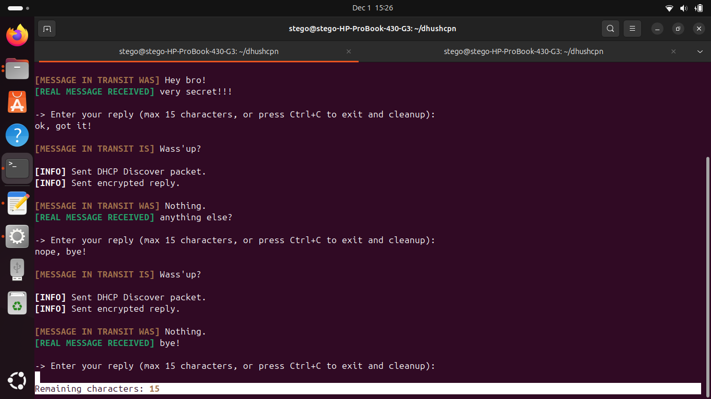

# 🛡️ DHushCP-n: DHushCP with Nested Steganography 🛡️


[](https://github.com/pdudotdev/DHushCP-n/releases/tag/v0.1.0)

## 📖 Table of Contents

- [🛡️ DHushCP-n: DHushCP with Nested Steganography](#%EF%B8%8F-dhushcp-covert-communication-via-dhcp-%EF%B8%8F)
  - [🔍 Overview](#-overview)
  - [🚀 DHushCP-n vs. DHushCP](#-dhushcp-n-vs-dhushcp)
  - [🖥️ System Requirements](#%EF%B8%8F-system-requirements)
  - [🛠️ Installation and Setup](#%EF%B8%8F-installation--setup)
  - [🔄 Communication Flow](#-communication-flow)
  - [🔐 Encryption and Hashing Algorithms](#-encryption-and-hashing-algorithms)
  - [🎯 Planned Upgrades](#-planned-upgrades)
  - [⚠️ Disclaimer](#%EF%B8%8F-disclaimer)
  - [📜 License](#-license)

## 🔍 Overview

**DHushCP** is a Linux tool designed to facilitate **secure covert wireless communication** between two parties - an Initiator and a Responder - using standard **DHCP (Dynamic Host Configuration Protocol)** packets. 

**DHushCP-n** is a Linux-based, secure communication tool built on top of **DHushCP**. This version introduces **nested text steganography**, enhancing **DHushCP**'s capabilities by embedding covert messages within cover texts using zero-width characters.

⚠️ **NOTE:** Read all about **DHushCP**'s features and functionality [**HERE**](https://github.com/pdudotdev/steganography/blob/main/3.%20DHushCP/README.md).

🍀 **NOTE:** This is an ongoing **research project** for educational purposes rather than a full-fledged production-ready tool, so treat it accordingly.

## 🚀 DHushCP-n vs. DHushCP

The original **DHushCP** secures the key and message exchange between the **Initiator** and the **Responder** by embedding the encrypted message in Option 226 of DHCP Discover packets.

### Benefits

With the original **DHushCP**, following the ECC-based key exchange the **plaintext message** entered by the user is:
- Encrypted using the shared **AES** key with **AES-GCM** with a **SHA-256** checksum appended
- Obfuscated using **Network Steganography** principles inside **DHCP Option 226**

***NEW!*** Now **DHushCP-n** adds yet another layer of obfuscation by using **Text Steganography**.<br /><br />
Therefore, with **DHushCP-n** the **plaintext message** entered by the user is:
- Embeded into a predefined 8-character `cover_text` string using zero-width characters
- Encrypted using the shared **AES** key with **AES-GCM** with a **SHA-256** checksum appended
- Obfuscated using **Network Steganography** principles inside **DHCP Option 226**

### Limitations 

Unlike the original **DHushCP**, the **DHushCP-n** version comes with some limitations:
- **Limited Per-Packet Capacity:** With an 8-character cover text, only 15 characters (secret message) can be embedded per DHCP Discover packet. Transmitting longer messages requires sending multiple packets, which may be noticeable under certain network conditions.
- **Potential Stripping by Systems:** Some systems, applications, or network devices might inadvertently strip or alter zero-width characters, disrupting message integrity or making embedded messages inaccessible.

## 🖥️ System Requirements

- **Operating System:** Linux-based systems (e.g., Ubuntu, Debian, Kali)
  - Latest release thoroughly tested and functional on **Ubuntu 24.04**.
- **Python Version:** Python 3.8 or higher
- **Dependencies:**
  - `scapy` for packet crafting and sniffing
  - `cryptography` for ECC encryption and checksum generation
- **Privileges:** Root or sudo access to send and receive DHCP packets
- **Network Interface:** Active wireless interface in UP state

## 🛠️ Installation & Setup

1. **Clone the Repository:** Use the commands below in your Linux terminal.
   ```bash
   mkdir dhushcpn
   cd dhushcpn
   python3 -m venv .dhushcpn
   source .dhushcpn/bin/activate
   git clone https://github.com/pdudotdev/DHushCP-n.git
   ```

2. **Install Dependencies:** Ensure you have Python 3.8 or higher installed. Then, install the required Python packages.
   ```bash
   pip install scapy cryptography colorama prompt-toolkit
   ```

3. **Configure Wireless Interface:** Ensure that your wireless interface is active and in the UP state. **DHushCP** will automatically detect and prompt you to select the active interface if multiple are detected.

4. **Run the Scripts:** Both Initiator and Responder scripts require root privileges to send and sniff DHCP packets. You can run the scripts using `sudo`:

**Responder:**
```
   cd ~/dhushcpn
   sudo .dhushcpn/bin/python DHushCP-n/dhushcp-n/responder.py --id DHUSHCP_ID
```

**Initiator:**
```
   cd ~/dhushcpn
   sudo .dhushcpn/bin/python DHushCP-n/dhushcp-n/initiator.py --id DHUSHCP_ID
```

Follow the on-screen prompts on the **Initiator** to initiate and manage the communication session. Make sure the **Responder** is already listening.

## 🔄 Communication Flow (DHushCP-n specific features highlighted)

1. **Initial Exchange:**
   - **Initiator:**
     - Generates a unique session ID.
     - Detects and selects the active wireless interface.
     - Generates an ECC key pair (private/public keys).
     - Embeds its public key, the DHUSHCP_ID (option 224), and session ID (option 225) into the DHCP Discover packet.
     - Sends the DHCP Discover packet and waits for the Responder's public key.
   
   - **Responder:**
     - Listens for DHCP Discover packets with option 224 set to DHUSHCP_ID.
     - Upon receiving a valid DHCP Discover (option 224 set to DHUSHCP_ID), extracts the session ID from option 225.
     - Extracts and reassembles the Initiator's public ECC key from the correct DHCP option.
     - Generates its own ECC key pair.
     - Embeds its public key, the DHUSHCP_ID, and the extracted session ID into a new DHCP Discover packet.
     - Sends the DHCP Discover and waits for Initiator's message.

2. **Message Transmission:**
   - **Initiator:**
     - Receives the Responder's public key from the DHCP Discover packet.
     - Derives the shared AES key using its private ECC key and the Responder's public ECC key.
     - Prompts the user to input a message to send to the Responder.
     - **Embeds the secret message into an 8-character cover-text (`"Hey bro!"`) using zero-width characters.**

     - Encrypts the **stego message** using the shared AES key with AES-GCM and adds a SHA-256 checksum.
     - Embeds the encrypted message with the checksum and session ID into a new DHCP Discover packet.
     - Sends the DHCP Discover packet containing the encrypted message.
   
   - **Responder:**
     - Receives the encrypted DHCP Discover packet from the Initiator.
     - Extracts and decrypts the message using the shared AES key.
     - **Decodes the stego message to retrieve the original secret message.**
     - Displays the decrypted message to the Responder user.
     - Prompts the Responder user to input a reply message.
     - **Embeds the secret reply into an 8-character cover-text (`"Wass'up?"`) using zero-width characters.**

     - Encrypts the reply using the shared AES key with AES-GCM and appends a SHA-256 checksum.
     - Embeds the encrypted reply with the checksum and session ID into a new DHCP Discover packet.
     - Sends the DHCP Discover packet containing the encrypted reply.

3. **Finalization:**
   - **Initiator:**
     - Receives the encrypted DHCP Discover packet containing the Responder's reply.
     - Decrypts the reply using the shared AES key.
     - **Decodes the stego message to retrieve the original secret message and displays the reply message to the Initiator user.**
     - **The two users can now continue communicating the same way further.**
     - From the **Initiator**'s side:

     - From the **Responder**'s side:

     - Upon request (`Ctrl+C`), performs cleanup by deleting encryption keys, clearing system logs (syslog, auth), and resetting the terminal.
   
   - **Responder:**
     - Upon request (`Ctrl+C`), performs cleanup by deleting encryption keys, clearing system logs (syslog, auth), and resetting the terminal.

## 🕵️‍♂️ Nested Text Steganography in DHushCP-n

DHushCP-n doesn’t just hide data inside DHCP packets - it can also hide the **user’s plaintext** inside a harmless-looking message using invisible Unicode characters. This creates a “stego inside stego” design:

1. Your plaintext is hidden inside a short, innocent cover text (using zero-width characters).
2. That stego text is then encrypted with AES-GCM.
3. The encrypted bytes are embedded in DHCP option 226.

Even if someone somehow decrypts the packet, what they see is still not the real message, but just a normal-looking string with invisible characters in between.

### How the Text Stego Layer Works

With text steganography, DHushCP-n uses **zero-width Unicode characters** to encode data:

- `U+200B` – Zero Width Space
- `U+200C` – Zero Width Non-Joiner
- `U+200D` – Zero Width Joiner
- `U+2060` – Word Joiner

These characters are **invisible** when printed normally, but they are still there as real bytes in the string.

The idea is simple:

1. Take the plaintext message (what the user actually wants to send).
2. Convert it to bits (each character → 8 bits).
3. Group bits into 2-bit chunks.
4. Map each 2-bit chunk to one of four zero-width characters.
5. Interleave those zero-width characters into a visible *cover text* like `"Hey bro!"`.

The resulting string looks harmless and human-readable, but its “gaps” are full of invisible data.

### Encoding: From Plaintext to Stego Text

Let’s say the user’s real message is:

> `hi`

1. Convert characters to bytes:
   - `h` → `01101000`
   - `i` → `01101001`

2. Concatenate and split into 2-bit groups:
   - `01101000 01101001` → `01 10 10 00 01 10 10 01`

3. Map each 2-bit group to a zero-width character, for example:
   - `01` → `U+200C` (Zero Width Non-Joiner)
   - `10` → `U+200D` (Zero Width Joiner)
   - `00` → `U+200B` (Zero Width Space)
   - `11` → `U+2060` (Word Joiner)

4. Take a cover text such as:

   `Hey bro!`

   and insert the zero-width characters between its visible characters:

   - After `H`, insert 1st zero-width character
   - After `e`, insert 2nd
   - After `y`, insert 3rd
   - and so on, appending any leftover zero-width chars at the end.

To a human (and most tools), the result still looks like:

> `Hey bro!`

But in reality the string is more like:

> `H[ZW]e[ZW]y[ZW] [ZW]b[ZW]r[ZW]o[ZW]![ZW]`

where `[ZW]` are invisible zero-width characters carrying the encoded bits of `"hi"`.

### Decoding: From Stego Text Back to Plaintext

On the receiving side, the process is reversed:

1. Scan the received text and **extract only the zero-width characters**.
2. Convert each zero-width character back into its corresponding 2-bit pattern.
3. Reassemble the 2-bit chunks into full bytes (groups of 8 bits).
4. Convert each byte back to an ASCII character.

By doing this, the original plaintext string (e.g. `"hi"`) is recovered in full.

The visible cover text is effectively just camouflage; the real payload is sitting in those invisible gaps.

### Why This Limits the Maximum Message Length

Each plaintext character:

- is 8 bits,
- which becomes 4 chunks of 2 bits,
- which become 4 zero-width characters,
- which are inserted into (or appended to) the cover text.

This makes the **stego string longer than the original plaintext**. That stego string is then encrypted with AES-GCM and placed into DHCP option 226, which has a strict maximum size of **255 bytes**.

Because the encrypted data must include:

- nonce (12 bytes),
- ciphertext (which scales with message length),
- checksum (32 bytes),

there’s a hard upper bound on how long the stego text - and therefore the original plaintext - can be.

In practice, this means:

- **Longer plaintext → more zero-width chars → bigger stego text → larger encrypted payload.**
- At some point, the payload would exceed the 255-byte DHCP option limit, so DHushCP enforces a sane maximum message length (e.g., 20–100 characters depending on the build).

### Why Use Text Stego at All?

Even though AES-GCM already encrypts the message, text steganography adds:

- **Plausible deniability**  
  Someone who decrypts the payload still sees only a normal-looking short phrase, not an obvious secret message.

- **Nested steganography**  
  The data is hidden first at the **text** level (zero-width characters), then inside the **network** level (DHCP option 226). You’re hiding a secret inside another secret.

- **Protection from prying eyes**  
  DHushCP-n hides the real message inside harmless-looking text using invisible characters, in case someone is looking over your shoulder when the message is being decrypted.

In short: encryption protects **confidentiality**, while text steganography improves **stealth**.

## 🎯 Planned Upgrades
- [x] Improved CLI experience
- [ ] DER encoding vs. PEM now
- [ ] More testing is needed

## ⚠️ Disclaimer
**DHushCP-n** is intended for educational and authorized security testing purposes only. Unauthorized interception or manipulation of network traffic is illegal and unethical. Users are responsible for ensuring that their use of this tool complies with all applicable laws and regulations. The developers of **DHushCP-n** do not endorse or support any malicious or unauthorized activities. Use this tool responsibly and at your own risk.

## 📜 License
**DHushCP-n** is licensed under the [GNU GENERAL PUBLIC LICENSE Version 3](https://github.com/pdudotdev/DHushCP-n/blob/main/LICENSE).