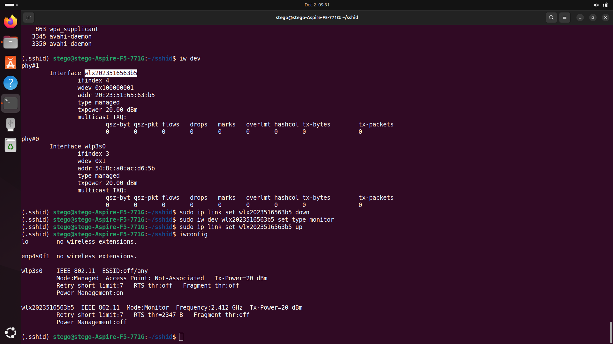
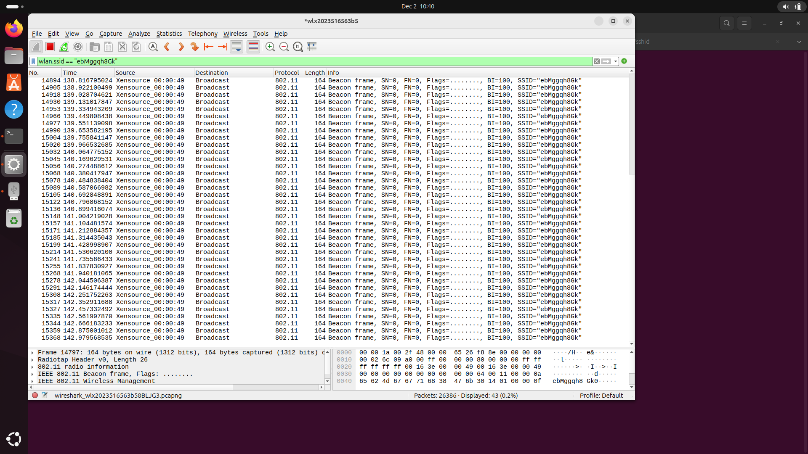

# 📡 SShiD - Covert Communication via SSID Beacons 📡


[](https://github.com/pdudotdev/SShiD/releases/tag/v0.2.0)

## 📖 **Table of Contents**

- [📡 SShiD: Covert Communication via SSID Beacons](#-sshid---covert-communication-via-ssid-beacons-)
  - [🔍 Overview](#-overview)
  - [🚀 Features](#-features)
  - [🛠️ Architecture](#%EF%B8%8F-architecture)
  - [🕵 System Requirements](#-system-requirements)
  - [🖥️ Monitor Mode](#%EF%B8%8F-monitor-mode)
  - [⚒️ Installation](#%EF%B8%8F-installation)
  - [⛑️ Usage](#%EF%B8%8F-usage)
  - [🔄 Communication Flow](#-communication-flow)
  - [🔐 Encryption and Security](#-encryption-and-security)
  - [🚫 Limitations](#-limitations)
  - [🎯 Planned Upgrades](#-planned-upgrades)
  - [⚠️ Disclaimer](#%EF%B8%8F%EF%B8%8F-disclaimer)
  - [📜 License](#-license)

## 🔍 **Overview**

**SShiD** is a proof-of-concept, Linux-based tool that utilizes principles of **network steganography** and enables covert communication by embedding encrypted messages within Wi-Fi beacon frames' **Vendor-Specific Information Elements (IEs)**. This method allows for discreet data transmission without establishing a traditional network connection.

🍀 **NOTE:** This is an ongoing **research project** for educational purposes rather than a full-fledged production-ready tool, so treat it accordingly.

*⚠️ **NOTE:** The code is currently maintained in a private repository and will be included in upcoming educational materials. It is available upon request, under certain conditions such as technical presentations or interviews.*

## 🚀 **Features**

- **Covert Communication:** Transmit messages without active network connections.
- **Encryption:** Utilizes ChaCha20-Poly1305 encryption for secure message transmission.
- **Custom SSID Generation:** Creates unique SSIDs based on a shared secret password.
- **Source Device Obfuscation:** The beacons are broadcasted using fake MAC addresses.
- **Vendor-Specific IEs:** Embeds messages within standard-compliant beacon frames.
- **Channel Specification:** Operates on a user-defined Wi-Fi channel (default is 1).

- **NOTE!** Reliability of using beacon frames for the communication flow.
  - For the sake of blending our covert traffic into the overall traffic, keep in mind that **communication via SShiD will not always be 100% reliable**. Since we're using broadcast messages over Wi-Fi, there's always a chance that packets can be lost due to network congestion, wireless interference, or other factors.

## ⚖️ **Architecture**

The project consists of two main components:

1. **Speaker:** Broadcasts beacon frames containing encrypted messages.
2. **Listener:** Sniffs beacon frames and extracts the hidden messages.

Both components use a shared secret password for SSID generation and message encryption/decryption.

## 🕵 **System Requirements**

- **Operating System:** Linux-based systems (e.g., Ubuntu, Debian, Kali)
  - Latest release tested and functional on **Ubuntu 24.04**
- **Python Version:** Python 3.8 or higher
- **Dependencies:**
  - `scapy` for packet crafting and sniffing
  - `cryptography` for encryption and decryption
- **Privileges:** Root or sudo access to send or sniff WiFi beacons
- **Network Interface:** Wireless interfaces in **UP** state and **Monitor** mode. **SShiD** will automatically detect and prompt you to select the active interface if multiple are detected.

## 🖥️ **Monitor Mode**

Monitor mode should be enabled on **both the Speaker and Listener** machines prior to using **SShiD**.
To identify your wireless interface and check if it supports Monitor mode use:
```bash
iw dev
sudo iw list | grep -A 10 "Supported interface modes"
```

To **enable Monitor mode** (assuming `wlx0` is your interface) use:
```bash
sudo apt update
sudo apt install aircrack-ng
```

Then enter the following commands:
```bash
sudo airmon-ng check kill
sudo ip link set wlx0 down
sudo iw dev wlx0 set type monitor
sudo ip link set wlx0 up
```
Or, if you prefer:
```bash
sudo airmon-ng check kill
sudo airmon-ng start wlx0
```

⚠️ Make sure you replace **wlx0** with the name of your own wireless interface.

After enabling Monitor mode, check with `iwconfig` to see if your interface shows **Mode: Monitor**.



⚠️ Some WiFi cards may show support for Monitor mode but not function properly, for instance when capturing frames. 

To check your **wireless adapter driver** use:
```bash
lspci -k | grep -A 3 -i network
```
or, for **USB adapters**:
```bash
lsusb
```

Additionally, **check logs** for failure messages if your adapter doesn't capture any traffic at all in Monitor mode.
```bash
sudo dmesg | grep -i <driver_name>
```

🍀 **NOTE:** Do your own research on your adapter and any issues related to Monitor mode. Best case scenario, you need a driver update. Otherwise, you need an adapter that supports Monitor mode. The cheapest option may be **TP-Link TL-WN722N**. Here's a tutorial on how to set it up to allow Monitor mode:
- [YouTube Tutorial](https://www.youtube.com/watch?v=LzfQAtndtLI)

✅ On the other hand, the most effective adapter for using Monitor mode and properly injecting data into beacons is possibly **Alfa Network AWUS036ACM** - which I use in my lab. I recommend this adapter for the **Speaker** machine, whilst for the **Listener** you can get away with either the integrated adapter or the aforementioned **TP-Link TL-WN722N**.

To **disable Monitor mode** and re-enable the default **Managed mode**:
```bash
sudo iw dev wlx0 set type managed
sudo systemctl start NetworkManager
```

## ⚒️ **Installation**

1. **Clone the Repository:**
   ```bash
   mkdir sshid
   cd sshid
   python3 -m venv .sshid
   source .sshid/bin/activate
   git clone https://github.com/pdudotdev/SShiD.git
   ```

2. **Install Dependencies:**
   ```bash
   pip install scapy cryptography colorama
   ```

## ⛑️ **Usage**

Both Speaker and Listener scripts require root privileges to send or sniff beacons. You can run the scripts using `sudo`:

**Listener:**
   ```
   sudo .sshid/bin/python SShiD/sshid/listener.py
   ```

**Speaker:**
   ```
   sudo .sshid/bin/python SShiD/sshid/speaker.py
   ```

⚠️ **NOTE!** Make sure that the **Listener** is running and listening *prior* to starting the **Speaker**.

## 🔄 **Communication Flow**

1. **Initialization:**
   - **Speaker** and **Listener** securely share a secret password before using **SShiD** (e.g. `test1234`).
   - Both set their wireless interfaces to Monitor mode (see previous instructions).

2. **SSID Generation:**
   - The **Speaker** generates a unique SSID by hashing the password.
   - This SSID serves as a beacon identifier for the **Listener**.
   - The **Listener** derives the same SSID from the pre-shared password.


3. **Message Encryption:**
   - The **Speaker** encrypts the message using ChaCha20-Poly1305 with a key derived from the password.

4. **Beacon Frame Construction:**
   - The **Speaker** constructs a beacon frame with:
     - The generated SSID.
     - The encrypted message embedded in a Vendor-Specific IE.
     - Standard IEs like RSN information for compliance.


5. **Broadcasting:**
   - The **Speaker** broadcasts a set of 50 beacon frames.

6. **Packet Capturing:**
   - The **Listener** captures beacon frames in monitor mode.
   - Captures only frames matching the unique SSID.



7. **Message Extraction:**
   - The **Listener** extracts the encrypted message from the Vendor-Specific IE.
   - Decrypts the message using the shared password.


8. **Output:**
   - The decrypted message is displayed to the user.
   - Broadcasting and listening are turned off.


🍀 **NOTE:** **SShiD** enables **one-to-many** communication between the **Speaker** and any **Listener** who knows the password. Therefore, the message exchange is **not** bidirectional.

## 🔐 **Encryption and Security**

⚠️ **DISCLAIMER**: Full transparency - since I am not an expert in cryptography, I used various public online resources as well as AI to find a proper solution and implementation for this aspect of DHushCP.

### Choice of Encryption and Hashing Algorithms

SShiD employs robust cryptographic algorithms to ensure the confidentiality and integrity of messages transmitted via Wi-Fi beacon frames. The following algorithms were chosen for their security and performance:

- **Key Derivation Function (KDF): PBKDF2HMAC with SHA-256**
  - **Reason for Choice:** PBKDF2 (Password-Based Key Derivation Function 2) with HMAC-SHA256 is a widely accepted standard for deriving cryptographic keys from passwords. It incorporates a salt and a high iteration count to mitigate brute-force and rainbow table attacks.

- **Symmetric Encryption: ChaCha20-Poly1305**
  - **Reason for Choice:** ChaCha20-Poly1305 is an authenticated encryption algorithm that provides both confidentiality and integrity. It is designed to be efficient in software and resistant to timing attacks. It is also used in modern protocols like TLS 1.3.

- **Hashing Algorithm: SHA-256**
  - **Reason for Choice:** SHA-256 is a cryptographic hash function that produces a 256-bit hash value. It is widely used and considered secure for generating unique identifiers, such as the SSID in this application.

### How Encryption and Hashing Secure the Communication

#### 1. Generating a Shared Secret SSID

- **Purpose:** Both the Speaker and Listener need to identify each other without broadcasting a known SSID that could be easily intercepted.

- **Process:**
  - The user provides a **secret password**.
  - **SHA-256** is used to hash the password combined with a fixed salt (`b'sshid_ssid_salt'`).

    ```python
    ssid_salt = b'sshid_ssid_salt'
    ssid_hash = hashlib.sha256(password.encode() + ssid_salt).digest()
    ```

  - The resulting hash is encoded using Base64 URL-safe encoding and truncated to create a unique, non-guessable SSID.

    ```python
    ssid = base64.urlsafe_b64encode(ssid_hash).decode('utf-8').rstrip('=')[:10]
    ```

- **Security Benefit:** Only users who know the secret password can generate the same SSID, preventing unauthorized parties from easily discovering the communication.

#### 2. Deriving the Encryption Key

- **Purpose:** Create a strong encryption key from the user-provided password to encrypt the message securely.

- **Process:**
  - Uses **PBKDF2HMAC** with SHA-256 to derive a 256-bit key from the password and a fixed salt (`b'sshid_encryption_salt'`).

    ```python
    kdf = PBKDF2HMAC(
        algorithm=hashes.SHA256(),
        length=32,
        salt=encryption_salt,
        iterations=100000,
    )
    key = kdf.derive(password.encode())
    ```

  - The iteration count (100,000) adds computational complexity, making brute-force attacks more difficult.

- **Security Benefit:** The derived key is cryptographically strong and resistant to attacks targeting weak or predictable keys.

#### 3. Encrypting the Message

- **Purpose:** Ensure that the message content remains confidential and tamper-proof during transmission.

- **Process:**
  - Generates a random 12-byte **nonce** for use with the ChaCha20-Poly1305 algorithm.

    ```python
    nonce = os.urandom(12)
    ```

  - Uses **ChaCha20-Poly1305** to encrypt the message with the derived key and nonce.

    ```python
    aead = ChaCha20Poly1305(key)
    ciphertext = aead.encrypt(nonce, message.encode('utf-8'), None)
    ```

  - Combines the nonce and ciphertext, then encodes them using Base64 URL-safe encoding for inclusion in the beacon frame.

    ```python
    data = nonce + ciphertext
    encoded_data = base64.urlsafe_b64encode(data).decode('utf-8').rstrip('=')
    ```

- **Security Benefit:**
  - **Confidentiality:** Only users with the correct key can decrypt the message.
  - **Integrity and Authenticity:** ChaCha20-Poly1305 provides built-in authentication, ensuring the message hasn't been tampered with.

#### 4. Including the Encrypted Message in Beacon Frames

- **Purpose:** Transmit the encrypted message covertly within Wi-Fi beacon frames.

- **Process:**
  - Constructs a **Vendor-Specific Information Element (IE)** in the beacon frame, including the encrypted message.

    ```python
    vendor_ie_info = vendor_oui_bytes + vendor_oui_type + encoded_data_bytes
    vendor_ie = Dot11Elt(ID=221, info=vendor_ie_info)
    ```

  - The beacon frame is broadcasted, and only listeners with the correct SSID and decryption key can retrieve and decrypt the message.

- **Security Benefit:** The message is hidden within standard Wi-Fi management frames, reducing the likelihood of detection by unauthorized parties.

#### 5. Decrypting the Message on the Listener

- **Purpose:** Allow the intended recipient to read the message securely.

- **Process:**
  - The Listener extracts the nonce and ciphertext from the received beacon frame.
  - Uses the same derived key and **ChaCha20-Poly1305** to decrypt the message.

    ```python
    plaintext = aead.decrypt(nonce, ciphertext, None)
    ```

- **Security Benefit:** Ensures that only recipients with the correct password can access the message content.

### Summary of Security Measures

- **Password-Based Security:** The use of a shared secret password ensures that only authorized users can generate the correct SSID and derive the encryption key.

- **Strong Cryptographic Algorithms:** Utilizing PBKDF2HMAC, SHA-256, and ChaCha20-Poly1305 provides a high level of security against known cryptographic attacks.

- **Nonce Usage:** The inclusion of a random nonce for each message prevents replay attacks and ensures that the same message encrypted multiple times will result in different ciphertexts.

- **Covert Communication:** Embedding the encrypted message within Wi-Fi beacon frames allows for discreet transmission without establishing a traditional network connection.

### Important Considerations

- **Secure Passwords:** Users should choose strong, unique pre-shared passwords before using SShiD.

- **Limited Exposure:** Since beacon frames are broadcasted, it's essential to minimize the transmission duration to reduce the risk of interception.

- **Environment Awareness:** Be mindful of local regulations and potential interference with other wireless networks when using this application.

By carefully integrating these encryption and hashing operations, SShiD ensures secure and confidential communication over Wi-Fi beacon frames, suitable for covert message transmission between parties who share a secret password.

## 🚫 Limitations
- **Hardware Compatibility**: Requires wireless adapters that support monitor mode and packet injection.
- **Range Constraints**: Effective communication range is limited to Wi-Fi transmission distances.
- **Legal Compliance**: Users must comply with local laws and regulations regarding wireless transmissions.

## 🎯 Planned Upgrades
- [X] Improved CLI experience
- [ ] More testing is needed

## ️⚠️ Disclaimer
**SShiD** is intended for educational and authorized security testing purposes only. Unauthorized interception or manipulation of network traffic is illegal and unethical. Users are responsible for ensuring that their use of this tool complies with all applicable laws and regulations. The developers of **SShiD** do not endorse or support any malicious or unauthorized activities. Use this tool responsibly and at your own risk.

## 📜 License
**SShiD** is licensed under the [GNU GENERAL PUBLIC LICENSE Version 3](https://github.com/pdudotdev/SShiD/blob/main/LICENSE).